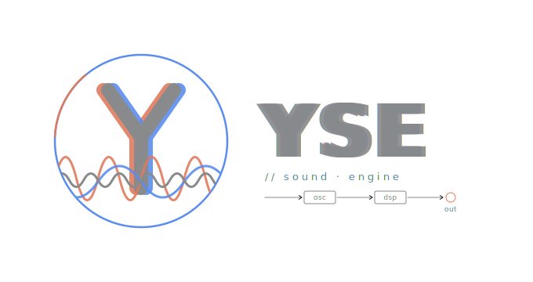

<p align="center">
  
</p>

# libYSE 2.2

libYSE is a cross-platform sound engine written in C++. PortAudio handles audio
I/O on desktop, Oboe (AAudio + OpenSL ES fallback) on Android, and libsndfile
decodes sample files everywhere. Windows, Linux, and Android are all supported
by the CMake build:

- **Windows** — MSYS2 Clang64 (primary) or MSVC
- **Linux** — system Clang or GCC (Ubuntu/Debian, Fedora/RHEL)
- **Android** — NDK r27+, API 26+, arm64-v8a and x86_64 (built via Gradle in `Tests/Android/`)

A flat `extern "C"` ABI (`yse_c/yse_*.h`) is folded into the same shared library
so language bindings (Dart FFI, Python ctypes, …) can call it without C++ ABI
compatibility — enabled by default via the `YSE_BUILD_C_API` option.

Beyond sample playback, libYSE hosts a polyphonic **synth subsystem**: a
virtual-analog / wavetable voice, a **DX7-class 6-operator FM voice** (with a
DX7 SysEx bank importer), and an **SFZ sampler voice**. The instrument DSP is
always compiled in — there is no feature switch to enable it. The *factory
sounds* those voices load (SFZ instruments and samples, wavetables, DX7/FM
`.SYX` banks) ship separately as an opt-in download — see
[Content pack](#content-pack-optional-instrument-assets).

**What is YSE trying to be?** Neither a game-audio engine nor a DAW: an
authored signal graph played by spatial and physical controllers, built
for experimental electronic music and live performance. The full
orientation lives in [docs/project_vision.md](docs/project_vision.md).

[](https://sonarcloud.io/summary/new_code?id=yvanvds_yse-soundengine)
[](https://sonarcloud.io/summary/new_code?id=yvanvds_yse-soundengine)
[](https://sonarcloud.io/summary/new_code?id=yvanvds_yse-soundengine)
[](https://sonarcloud.io/summary/new_code?id=yvanvds_yse-soundengine)
[](https://sonarcloud.io/summary/new_code?id=yvanvds_yse-soundengine)
[](https://sonarcloud.io/summary/new_code?id=yvanvds_yse-soundengine)


---

## Building on Windows (MSYS2 Clang64)

### Prerequisites

Open an **MSYS2 CLANG64** shell and install the required packages:

```sh
pacman -S --needed \
  mingw-w64-clang-x86_64-cmake \
  mingw-w64-clang-x86_64-ninja \
  mingw-w64-clang-x86_64-clang \
  mingw-w64-clang-x86_64-portaudio \
  mingw-w64-clang-x86_64-libsndfile \
  mingw-w64-clang-x86_64-rtmidi
```

`rtmidi` is required when the MIDI device backend is enabled (the default on
desktop). To build without it, configure with `-DYSE_ENABLE_MIDI_DEVICE=OFF` —
the rest of the engine (MIDI file playback, music primitives, patcher) is
unaffected and still builds.

### Configure and build

```sh
cd /path/to/yse-soundengine
cmake -B build -G Ninja
cmake --build build
```

The shared library and demo executables are placed in `build/bin/`.

### Run a demo

Demos use hard-coded relative paths (`../../TestResources/...`) so they
**must be run from the `build/bin/` directory**:

```sh
cd build/bin
./Demo00.exe          # Play a sound
./Demo05.exe          # Reverb
# … etc.
```

### Build types

```sh
cmake -B build -G Ninja -DCMAKE_BUILD_TYPE=Release
cmake -B build -G Ninja -DCMAKE_BUILD_TYPE=RelWithDebInfo
```

### Optional flags

| CMake option | Default | Description |
|---|---|---|
| `YSE_ENABLE_LTO` | `OFF` | Link-time optimisation for Release builds |
| `YSE_NATIVE_ARCH` | `OFF` | Add `-march=native` (local builds only — not for distributable binaries) |
| `YSE_BUILD_TESTS` | `OFF` | Build the `Tests/` doctest suite and enable CTest |
| `YSE_BUILD_BENCHMARKS` | `OFF` | Build the `Bench/` google-benchmark suite (fetched on demand) |
| `YSE_BUILD_C_API` | `ON` | Fold the `extern "C"` ABI bridge into `libyse` |
| `YSE_ENABLE_MIDI_DEVICE` | `ON` (desktop) | RtMidi-backed MIDI device backend |
| `YSE_FETCH_CONTENT_PACK` | `OFF` | Download the optional instrument [content pack](#content-pack-optional-instrument-assets) (SFZ instruments, wavetables, DX7/FM banks) |
| `YSE_INSTALL_CONTENT_PACK` | `OFF` | Install the content pack under `<prefix>/share/yse/content` |

---

## Building on Linux

### Prerequisites (Debian/Ubuntu)

```sh
sudo apt install \
  cmake ninja-build clang \
  libportaudio-dev libsndfile1-dev librtmidi-dev
```

### Prerequisites (Fedora/RHEL)

```sh
sudo dnf install \
  cmake ninja-build clang \
  portaudio-devel libsndfile-devel rtmidi-devel
```

`librtmidi` (the ALSA-backed MIDI device library) is required when the MIDI
device backend is enabled (the default on Linux). Configure with
`-DYSE_ENABLE_MIDI_DEVICE=OFF` to build without it.

### Configure and build

```sh
cmake -B build -G Ninja
cmake --build build
```

### Run a demo

```sh
cd build/bin
./Demo00          # Play a sound
```

The `$ORIGIN` rpath is embedded in each demo binary so that `libyse.so` is
found automatically from the same directory.

---

## Building on Android

The Android build is wired through Gradle in `Tests/Android/`. It produces a
NativeActivity APK that ships `libyse_tests.so` (the full test suite) for two
ABIs — `arm64-v8a` and `x86_64`. The release workflow at
`.github/workflows/release.yml` builds production multi-ABI archives the same
way and publishes them as release assets.

### Prerequisites

- NDK r27+ installed (Android Studio's SDK Manager → NDK (Side by side))
- Gradle 8+ (the wrapper in `Tests/Android/gradlew` will use it automatically)
- An attached device or emulator at API 26+

### Build and run on-device

```sh
cd Tests/Android
./gradlew installDebug
adb shell am start -n net.attrx.yse.tests/.MainActivity
adb logcat -s yse_tests
```

The engine fetches libsndfile 1.2.2 and Oboe 1.9.3 from source via
`FetchContent` on the first configure — no system packages are required. RtMidi
is unused on Android (the MIDI device source files compile to empty TUs).

---

## Development workflow

If you have Python 3.8+ available, `yse.py` at the repo root provides a
Flutter-style CLI for the common tasks.  On Windows run it via:

```sh
python yse.py build              # configure + debug build (default)
python yse.py build --release    # release build
python yse.py build --python     # debug build with the embedded-Python live-coding feature (desktop only)
python yse.py build --content-pack  # debug build + fetch the optional SFZ/DX7/FM content pack
python yse.py test               # build tests-debug preset, run ctest
python yse.py test --python      # tests-debug-python preset — also runs the embedded-interpreter suite
python yse.py coverage           # coverage build + gcovr report (Linux only)
python yse.py run                # run Demo00 from build-debug/bin/
python yse.py run Demo05         # run a specific demo
python yse.py debug Demo00       # launch under lldb
python yse.py clean              # remove all build directories
python yse.py analyze [path]     # run clang-tidy; path narrows scope (default: full tree)
python yse.py format             # clang-format on YseEngine/ and Tests/
```

On Unix you can also `chmod +x yse.py` and use `./yse.py <command>`.
Pass `--help` to any subcommand for full usage.

The script is a thin wrapper over `cmake --preset` / `ctest --preset` calls.
`CMakePresets.json` at the repo root defines every named configuration; IDEs
with CMake Tools support (VS Code, CLion, Visual Studio) discover it
automatically without any extra setup.

Direct `cmake -B build ...` invocations remain fully valid — the presets are
additive and do not change how the build works when invoked directly.

---

## Content pack (optional instrument assets)

libYSE's instrument voices — the virtual-analog / wavetable voice, the
DX7-class 6-operator **FM voice** (plus its DX7 SysEx bank importer), and the
**SFZ sampler voice** — are **always compiled** into `libyse`. There is no
`YSE_ENABLE_FM` / `YSE_ENABLE_SFZ` compile switch; the instrument DSP is always
present.

What *is* optional is the **content pack**: the factory sounds those voices
load at runtime — SFZ instruments and samples, single-cycle wavetables, and
DX7/FM `.SYX` banks. None of it is baked into the binary (`libyse` links no
asset); it is plain data read by the normal file loaders. A small CC0 seed is
committed under `content/`; the larger third-party collections and the DX7
factory banks are pulled only on demand by two opt-in CMake options (both
`OFF` by default):

| Option | Effect |
|---|---|
| `YSE_FETCH_CONTENT_PACK` | Download the third-party pack sources into `content/`, verifying each against its SHA-256 pin when one is set (an unpinned source downloads unverified with a warning; pins are optional — never invented) |
| `YSE_INSTALL_CONTENT_PACK` | Install the assembled pack to `<prefix>/share/yse/content` |

Enable them through the Python workflow (no need to drop to raw `cmake`):

```sh
python yse.py build --content-pack                        # debug build + fetch the pack
python yse.py build --release --content-pack              # release build + fetch
python yse.py build --content-pack --install-content-pack # also install it
```

`--install-content-pack` implies `--content-pack`. The equivalent direct
invocation is `cmake -B build -G Ninja -DYSE_FETCH_CONTENT_PACK=ON`.

**DX7 factory-bank licensing caveat.** The DX7 factory-style ROM voice banks
are **tolerated, but not legally cleared** — Yamaha has never released these
voice data sets under an open license. They are fetched only when
`YSE_FETCH_CONTENT_PACK` is ON, land in `content/fm/dx7-factory/`, and every
consumer treats that folder as optional (deleting it is a clean opt-out). For
an unambiguously CC0 FM bank authored by this project, use
`content/fm/original/yse_originals.syx`. Full provenance and licenses for every
asset are in [CONTENT-LICENSES.md](CONTENT-LICENSES.md).

---

## Documentation

API reference is generated from the source by **Doxygen + Sphinx + Breathe**
using the `sphinx-book-theme`. Sources live under `documentation/`.

### Local preview

Install the toolchain (Doxygen 1.9+ from your package manager, Python deps
from the requirements file):

```sh
# Debian/Ubuntu
sudo apt install doxygen graphviz
# macOS (Homebrew)
brew install doxygen graphviz
```

On Windows, install the official binaries (both add themselves to `PATH`):

- Doxygen — <https://www.doxygen.nl/download.html> (the `doxygen-x.x.x-setup.exe` installer)
- Graphviz — <https://graphviz.org/download/> (the Windows installer; tick *"Add Graphviz to the system PATH"*)

Then install the Python dependencies (works on every OS):

```sh
pip install -r documentation/requirements.txt
```

Build the site:

```sh
cd documentation
make html        # Linux/macOS/MSYS2: doxygen XML + sphinx HTML
make.bat html    # Windows cmd
```

The HTML lands in `documentation/build/html/`. Preview it with the
built-in server:

```sh
make serve       # http://localhost:8000
```

You can run the two stages separately while iterating: `make doxygen`
regenerates the XML under `source/_doxygen/` (only needed when source
comments change), and `make sphinx` rebuilds just the HTML (fast). Use
`make clean` to wipe `build/` and `source/_doxygen/`.

### CI

`.github/workflows/documentation.yml` builds the docs on every push to
`master` and publishes the result to GitHub Pages. The workflow assumes
Pages is configured for the repo with **Source: GitHub Actions**
(Settings → Pages).

---

## Project structure

| Directory | Contents |
|---|---|
| `YseEngine/` | Engine source (compiled into `libyse`); `c_api/` holds the flat C ABI bridge |
| `Tests/` | doctest unit suite (`YSE_BUILD_TESTS=ON`); `Tests/Android/` packages it as a NativeActivity APK |
| `Bench/` | google-benchmark suite (`YSE_BUILD_BENCHMARKS=ON`); CI pushes results to the `bench-history` orphan branch |
| `Demo.Windows.Native/` | Native C++ demos (one executable each) — Windows only |
| `TestResources/` | Audio files referenced by demos |
| `documentation/` | Doxygen + Sphinx + Breathe documentation sources |
| `tools/ci-linux/` | Docker images for local Linux CI reproduction (`Dockerfile`, `Dockerfile.audio`) |
| `dependencies/` | Vendored headers (rtmidi, doctest); PortAudio/libsndfile system packages on desktop |

A deeper architectural reference lives in [PROJECT_OVERVIEW.md](PROJECT_OVERVIEW.md).

---

## Known issues

Tracked in [GitHub Issues](https://github.com/yvanvds/yse-soundengine/issues).

---

## License

libYSE is distributed under the [MIT License](LICENSE.md).
